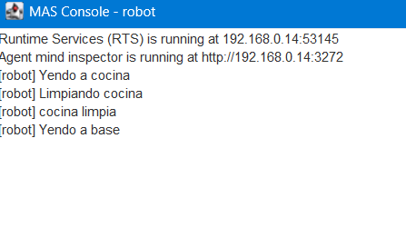
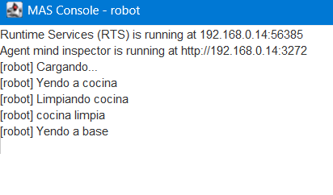
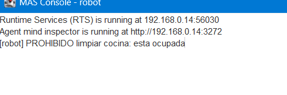
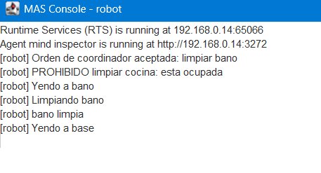

# Robot de limpieza: lógica modal y AgentSpeak (Jason)

Especificación con lógica modal de diez enunciados y su implementación en AgentSpeak (Jason).

## Notación

- `B_i(P)`: el agente *i* cree P
- `D_i(P)`: el agente *i* desea P
- `I_i(P)`: el agente *i* tiene la intención de P
- `□` siempre, `◇` en algún momento futuro, `U` hasta que (operadores temporales)
- `F(P)`: P está prohibido (operador deóntico)

La lógica BDI base no expresa tiempo ni normas. Por eso los enunciados 6, 7 y 8 usan operadores temporales y deónticos.

## Enunciados, fórmulas e implementación

| # | Enunciado | Fórmula modal | Implementación en Jason |
|---|---|---|---|
| 1 | El robot cree que la cocina está sucia | `B_r(sucia(cocina))` | Creencia inicial `sucia(cocina).` |
| 2 | Si cree que una habitación está sucia, desea que esté limpia | `∀x (B_r(sucia(x)) → D_r(limpia(x)))` | `+sucia(H) : habitacion(H) <- !limpia(H).` |
| 3 | No sabe si el salón está libre | `¬B_r(libre(salon)) ∧ ¬B_r(¬libre(salon))` | No existe `libre(salon)` ni `~libre(salon)` |
| 4 | Cree que el coordinador cree que el baño está sucio | `B_r(B_c(sucia(bano)))` | `cree(coordinador, sucia(bano)).` |
| 5 | Solo se compromete a limpiar si cree que tiene batería suficiente | `I_r(limpiar(x)) → B_r(bateria_suficiente)` | Plan con contexto `not bateria_suficiente` que carga primero |
| 6 | Mantiene la intención hasta que crea que está limpia o que es imposible | `I_r(limpiar(x)) U (B_r(limpia(x)) ∨ B_r(imposible(limpiar(x))))` | Recursión `!limpia(H)` con planes de parada primero |
| 7 | Si la batería baja del 20 %, acabará cargado | `□(B_r(bateria<20) → ◇B_r(cargado))` | `+bateria(B) : B < 20 <- !cargar.` |
| 8 | Prohibido limpiar una habitación ocupada | `F(limpiar(x) ∧ ocupada(x))` | Plan con contexto `ocupada(H)` que impide limpiar |
| 9 | Si cree que el coordinador desea que limpie y reconoce su autoridad, adopta la intención | `B_r(D_c(limpia(x))) ∧ B_r(autoridad(c)) → I_r(limpia(x))` | `+desea(Q, limpia(H)) : autoridad(Q) <- !limpia(H).` |
| 10 | Sin intención de limpiar, desea volver a la base | `¬∃x I_r(limpiar(x)) → D_r(en(base))` | `+!volver` con `.intend(limpia(_))` |

## Decisiones de diseño

- **Batería suficiente:** se considera suficiente a partir del 30 %. Es un umbral elegido por mí, porque el enunciado no lo fija.
- **Creencia anidada (enunciado 4):** `B_r(B_c(sucia(bano)))` se representa con el predicado `cree(coordinador, sucia(bano))`, ya que Jason no tiene creencias anidadas nativas.
- **Enunciado 3:** el robot "no sabe" porque no existe ni `libre(salon)` ni `~libre(salon)`. En Jason, no creer p no equivale a creer ~p.
- **Orden de los planes:** Jason elige el primer plan aplicable, por eso las condiciones de parada, la prohibición y la comprobación de batería van antes del plan que limpia.

## Ejecución

Requisitos: Java 17 o superior y Jason.

```bash
jason robot.mas2j
```

## Pruebas

| Prueba | Cambio en `robot.asl` | Resultado esperado |
|---|---|---|
| Caso normal | Ninguno | Limpia la cocina y vuelve a la base |
| Batería baja (5 y 7) | `bateria(10).` en vez de `bateria(80).` | Carga antes de limpiar |
| Habitación ocupada (8) | Añadir `ocupada(cocina).` | Imprime "PROHIBIDO limpiar" |
| Orden del coordinador (9) | Añadir `desea(coordinador, limpia(bano)).` | Limpia el baño |

## Capturas

Caso normal:



Batería baja:



Habitación ocupada:



Orden del coordinador:


